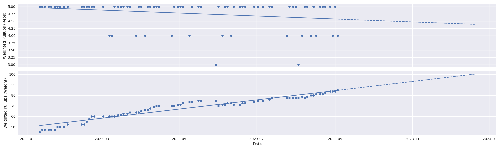

# progress
`progress` is a tool to planning, tracking, and visualizing progress of all kinds. We'll try to make it as easy as possible, but you have to put in the real effort.

# Usage
Here, we'll guide you through how to start using `progress`.

## Pre-reqs:
1. We recommend using [Obsidian](https://obsidian.md/) to visualize your files. This will make it easy to write plans, log your practices, etc.
2. Set up a python 3.9 virtual environment and install the requirements from `requirements.txt` with something like
    ```sh
    python -m pip install -r requirements.txt
    ```

## Getting Started
1. Create a directory that you want to be managed via `progress`.
2. Create a `config.yml` file in the root of this repository with a single property,
`activity_vault`, whose value will be the absolute path of the directory created in
step 1. For example:
    ```yml
    activity_vault: /my/directory/of/choice/goes/here
    ```

3. Create an **Activity** you want to progress in by using the following command.
Note that we will use **Calisthenics** as an example activity, but you can create
any activities that are relevant for you!
    ```sh
    python src/main.py activity create --name Calisthenics
    ```
    Note that a new directory is created within the root directory you specified in
    the `config.yml`, with subdirectories `Plan` and `Practice`. These subdirectories
    are empty for now, but we will fill them out momentarily.

4. Create a **Plan** for how you're going to practice this activity. Often, you will just have a single active **Plan**, but at other times you may find it useful to have multiple Plans for the same activity. We will consider a Plan **Workouts** for the purpose of this example. Note that
there are a few steps to creating a Plan:

    1. Create a Plan template using the following command:
        ```sh
        python src/main.py plan create --activity Calisthenics --name Workouts
        ```
        This will create a new directory under `Calisthenics/Plan` named
        `YYYY-MM-DD Workouts`, filled out with today's date. This directory holds a file
        `Schedule.md`, which allows you to specify what kind of sessions you want to
        perform at what day and time every week. This file is a template for now, but
        we will fill it out momentarily.
    2. Create a **Session** for each of the types of practices you want to be a part of
    this plan. In our example, let's create three Sessions: **Push**, **Pull**, **Legs**:
        ```sh
        python src/main.py session create --activity Calisthenics --plan Workouts --name Push
        python src/main.py session create --activity Calisthenics --plan Workouts --name Pull
        python src/main.py session create --activity Calisthenics --plan Workouts --name Legs
        ```
        This will create a new files `Push.md`, `Pull.md`, `Legs.md` in `YYYY-MM-DD Workouts`.
    3. Fill out each **Session** with the **Exercises** as you'd like to perform in
    that session. An approximate template is provided, but must be customized
    for your Session. For example:
        ```md
        # Pull
        - Weighted Pullups
            - Metric: Reps | Weight
            - Reps: 3 - 5
            - Rest: 5 mins
            - Sets: 4
        - Front Lever
            - Metric: Variation | Seconds
            - Rest: 3 mins
            - Sets: 3
        ```
    For more documentation on how to specify different exercises, see TODO.

    4. Fill out the schedule template with the different sessions you would like to perform in
    a given week. Note that any day that has no sessions should be marked as "Rest,"
    as in the example below:
        ```md
        # Monday
        - Pull
            - 08:00 - 09:00
        - Legs
            - 17:00 - 18:00
        # Tuesday
        - Push
            - 17:00 - 18:00
        # Wednesday
        - Rest
        # Thursday
        - Pull
            - 08:00 - 09:00
        - Legs
            - 17:00 - 18:00
        # Friday
        - Push
            - 17:00 - 18:00
        # Saturday
        - Rest
        # Sunday
        - Rest
        ```

5. Schedule your practices! Now that your plan is complete, run the following command
to fill create a **Practice** for each day in the near future:
    ```sh
    python src/main.py plan schedule --activity Calisthenics --plan Workouts --until 2024-01-01
    ```
    This will use your weekly schedule and corresponding sessions to create a file
    for each practice from today until the date specified (here, 2024-01-01).
    Each practice file will be named according to 1) the date of the practice, 2) the plan name, and 3) the session name. For example, `2023-09-04 Workouts - Pull.md`.

    As you might end up with *many* practices over time, the contents of the `Practice`
    directory are stored hierarchically by date. So, the example above would be found
    at `Practice/2023/2023-09/2023-09-04 Workouts - Pull.md`. This makes it much easier
    to navigate when you have a large number of practices for a given activity.

6. Go out and practice your activity! While (or after) practicing your activity,
fill out the corresponding practice file. The example file referenced in step 4 will
initially look like the following:
    ```md
    # Pull
    ### HH:MM - HH:MM
    - Weighted Pullups
        - Metric: Reps | Weight
        - Reps: 3 - 5
        - Rest: 5 mins
        - Sets: 4
        1.
        2.
        3.
        4.
    - Front Lever
        - Metric: Variation | Seconds
        - Rest: 3 mins
        - Sets: 3
        1.
        2.
        3.

    ## Notes
    -
    ```
    In order to fill out the releavnt information of your practice, follow these steps:
    1. Change the HH:MM - HH:MM to the times you actually started/ended your practice.
    2. As you go through each set of an exercise, fill out the information referenced
    after "Metric:" next to the number corresponding to the set you just completed.
    If there are multiple metrics for an exercise, separate each metric by a comma (and
    probably a space, to make it look nice!), each with appropriate units. For more
    documentation on how to fill out information about a specific set, see TODO.
    3. At any point, if you make any qualitative observations about the exercises or
    any context around your practice, place these observations in the "Notes" section at
    the bottom of the page. Feel free to add as many items to this list of notes as are
    needed.

    After completing your practice, the file should look something like this:
    ```md
    # Pull
    ### 18:30 - 19:30
    - Weighted Pullups
        - Metric: Reps | Weight
        - Reps: 3 - 5
        - Rest: 5 mins
        - Sets: 4
        1. 50 lbs, 5
        2. 55 lbs, 5
        3. 60 lbs, 4
        4. 60 lbs, 3
    - Front Lever
        - Metric: Variation | Seconds
        - Rest: 3 mins
        - Sets: 3
        1. Tuck, 20 s
        2. Straddle, 10 s
        2. Straddle, 7 s

    ## Notes
    - Just ate an entire pizza before working out. Feels like a high gravity day!
    - Really focus on scapular protraction when doing planche! Greatly helped today.
    ```

    Keep this up, and soon you might be able to gain some insights into your progression
    through these practices!

7. Once you've practiced for a while, you can start using your previously tracked
practices to gain insight into how you are progressing! There are a few ways of going
about this:
    1. (_Ad-hoc_) **Visualize a your progress in a single exercise.** In order to
    visualize your progress in a single exercise, run the following command:
        ```sh
        python src/main.py exercise visualize --activity <your activity> --name <your exercise> [--start YYYY-MM-DD]
        ```
        Considering an example of Weighted Pullups from above:
        ```sh
        python src/main.py exercise visualize --activity Calisthenics --name "Weighted Pullups" --start 2023-01-10
        ```

        This will create a visualization like the following: 
        Points on the plot indicate measurements, and the line is a linear regression
        of the metric over time. Related statistics and predictions will also be
        provided in the terminal.


    2. (_Systematic_) **Create a report on your progress over a set of exercises.** In
    order to create a report for a set of exercises, there are a handful of steps.

        1. Generate a template of the report. To start, run the following command
        with appropriate arguments.
            ```sh
            python src/main.py report template --activity Calisthenics --name "Pulling Strength"
            ```
            This will create a new `Pulling Strength` directory in
            `Calisthenics/Report` with a single file in it, `Template.md`:

            ```md
            - Exercise: exercise name 1 here
            - Exercise: exercise name 2 here (optional, can put more)
            - Start: YYYY-MM-DD (optional)
            ```

        2. Edit the template to indicate which exercises should be analyzed, and
        optionally, what date to start analyzing these exercises from. For example:

            ```md
            - Exercise: Weighted Pullups
            - Start: 2023-01-10
            ```
        3. Finally, generate the report. This is done simultaneously for all reports
        defined for an activity via a command like
            ```sh
            python src/main.py report generate --activity Calisthenics
            ```
            After running this command, you will see that a new `Visualization.png` file
            is created (feel free to ignore this, as it is also shown in the report),
            along with a `Report.md` file, both in the same location as `Template.md`.

            ```md
            # Weighted Pullups (Weight)
            ## Rates
            - Increase per Session: **0.36**
            - Increase per Week: **1.00**
            ## Predictions
            - 1 Month (4 Weeks): **88.76**
            - 1 Season (13 Weeks): **97.74**
            - 1/2 Year (26 Weeks): **110.72**
            - 1 Year (52 Weeks): **136.67**
            # Weighted Pullups (Reps)
            ## Rates
            - Increase per Session: **-0.00**
            - Increase per Week: **-0.01**
            ## Predictions
            - 1 Month (4 Weeks): **4.52**
            - 1 Season (13 Weeks): **4.42**
            - 1/2 Year (26 Weeks): **4.26**
            - 1 Year (52 Weeks): **3.96**
            # Visualization
            ```
            

            Note that this is all of the same information as included in a
            single-exercise visualization, but is all placed in an easily-viewable
            markdown file, can be easily updated, and can support multiple exercises
            at once.


# Content
Here, we'll go over the key elements of `progress` and how to interact with them.
## Activities
In order to work its magic, `progress` interfaces with a directory on your computer that holds information on your progress for a specific **activity**.

Example activities:
- Rock Climbing
- Calisthenics
- Park Skiing
- Typing

## Practices
In order to progress, you need to **practice**. `progress` can track your practices in a few main ways:
1. Track when you show up. This is a prerequisite for everything else, so you should know when you do this!
2. Track the content & success of your practices. Whether this is weight/sets/reps, words per minute, or whether you stomped the trick, we can track it. Don't want to get bogged down and distracted by tracking every little thing? No worries. Track as much detail as you like (e.g. "50% of my session I projected some V6-V7 slab problems, then I finished up with some easier overhangs & campusing")
3. Key qualitative notes from your practice. If you're trying to hold a handstand longer and you finally find something that ticked, you *need* to remember what you did. Track some notes, maybe even link a video showing what you did right.

## Plans
Planning is important in order to guide our progress toward our goals. There are two high-level parts of planning:
1. **Long-term schedule**. How many days a week are you climbing? How many sets a week are you training each muscle group? Get a plan together that you can follow.
2. **Individual session plan**. What exercises are you doing on your leg days? When during your typing practice will you add in punctuation to your all-lowercase typing? If you can have roughly do the same thing on the same days on a weekly basis, great. Try to abstract to some level where you can reliably repeat this schedule for many sessions, and you can go into the details in your practice log. Finally, this should also outline what information should be recorded about this session.

## Reports


---
# Development
If you just want to use `progress` but not contribute to it, no need to read further!

If you for whatever reason do feel like contributing, we'll go over the dev setup and outline of the project here.

## Getting Started
First, pre-requisites:
- python3.9

Once you have python set up (preferably in a virtual environment), install the python requirements at `requirements.txt` with something like `python -m pip install -r requirements.txt`.

For convenience, we have provided a `.pre-commit-config.yml` file. This will run all linting & formatting on your code before making a commit. Please run `pre-commit install` to set up pre-commit hooks before making commits to use this.

## Code Outline
Super simple now. Source code goes under `src`. This just contains a script, `main.py`.

## Managing Dependencies
We use `pip-compile` from [`pip-tools`](https://github.com/jazzband/pip-tools) to manage python dependencies. Add in whatever python packages and version requirements to `requirements.in`, then run `pip-compile` to automatically generate a `requirements.txt` file with specific versions of everything that match your specifications in `requirements.in`.
